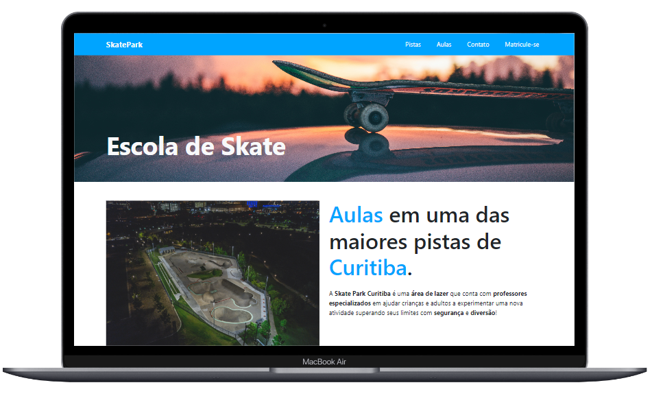

<a id='ancora'></a>
# Skate Park- Gama Academy - XP 44 🚀

<br><br>

- [Sobre a Gama Academy](#ancora1) <br>
- [Sobre o Gama Experience](#ancora2) <br>
- [Sobre o Projeto](#ancora3) <br>
- [Competências Desenvolvidas](#ancora4) <br>
- [Entregável](#ancora5) <br>
- [Execução](#ancora6) <br>
- [Desenvolvedora](#ancora7)

<br><br>


<a id="ancora1"></a>
## Sobre a Gama Academy 🏫

<br>

Empresa de educação que prepara talentos para o mercado digital. Em seus programas educacionais, as pessoas participantes enfrentam desafios reais, se conectam com empresas digitais, recebem mentorias de profissionais que estão mandando bem em suas áreas e, ainda têm a oportunidade de ensinar e aprender com a nossa comunidade visando o emprego, transição de carreira e o life long learning.

<br>

<a id="ancora2"></a>
## Sobre o Gama Experience 👨🏽‍💻

<br>

É um curso com duração de 6 meses, com o objetivo de formar os melhores juniores do mercado, nas áreas de Desenvolvimento Web e Designers UX/UI! A primeira versão do curso foi lançada pela Gama Academy em 2016 e já empregou mais de 3.000 pessoas.  A versão atual contém mais de 810 horas de aulas, desafios e mentorias, com foco na  empregabilidade de nossos estudantes!

<br>

<a id="ancora3"></a>
## Sobre o Projeto ✔️

<br>

A principal idéia era criar um site utilizando Bootstrap como ferramenta, simulando uma página de skate.

<br><br>

Para ajudar nos atendimentos, eles precisam de uma API que permita criar registros de
psicólogos, pacientes e prontuários. Em uma conversa com os Front-end e os PO foram
decididos alguns grupos de endpoints que devem ser criados.

<br>

<a id="ancora4"></a>
## Competências Desenvolvidas 📝

<br>

* Form;
* buttum;
* Backgroud;

<br>


<a id="ancora7"></a>
## Execução 💻

 


<br>

Clone este repositório remoto em seu equipamento:
```
https://github.com/Karolinegaia/skate-park-bootstrap.git
```
<br>
<a id="ancora9"></a>
## 🤝 Desenvolvedora

Projeto desenvolvido por:
<table>
  <tr>
    <td align="center">
      <a href="https://www.linkedin.com/in/karoline-gaia-alexandre-919b31120">
        <br>
        <sub>
          <b>Karoline Gaia Alexandre</b>
        </sub>
      </a>
    </td>
</table>